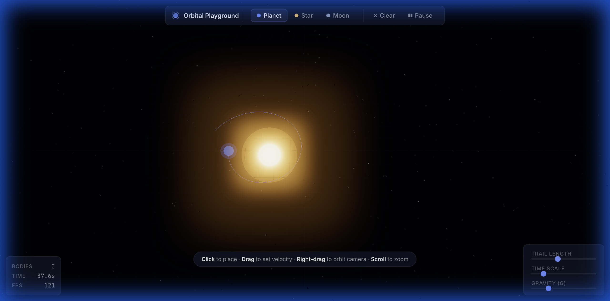

# Orbital Playground

[](https://github.com/nordinbelkacemi/orbital-playground/actions/workflows/deploy.yml)
[](LICENSE)
[](https://nordinbelkacemi.github.io/orbital-playground/)

An interactive 3D N-body gravity simulator built with Three.js. Place stars, planets, and moons, fling them into orbit, and watch orbital mechanics unfold in real-time with bloom lighting and volumetric glow.



## Try It

**[Live Demo](https://nordinbelkacemi.github.io/orbital-playground/)** — runs entirely in your browser. No install, no build step.

- **Click** to place a body
- **Drag** to set its velocity
- **Right-drag** to orbit the camera, **scroll** to zoom
- **1/2/3** to switch between planet/star/moon
- **Space** to pause, **C** to clear

## Run Locally

```bash
git clone https://github.com/nordinbelkacemi/orbital-playground.git
cd orbital-playground
npm install
npm run dev        # http://localhost:3000
```

## Test

```bash
npm test           # run once
npm run test:watch # watch mode
```

## Architecture

Vanilla JavaScript with ES modules + Three.js via import map. No frameworks, no build step.

```
src/
  js/
    core/
      Vector3.js        # Immutable 3D vector math
      Body.js            # Celestial body entity
      Simulation.js      # N-body physics (Velocity Verlet)
    rendering/
      Renderer3D.js      # Three.js scene, bloom, trails
    config.js            # All tuneable constants
    app.js               # Composition root
  css/
    main.css             # Design tokens and UI styles
  index.html             # Import map for Three.js
```

See [`ARCHITECTURE.md`](ARCHITECTURE.md) for design principles and data flow.

## License

MIT
